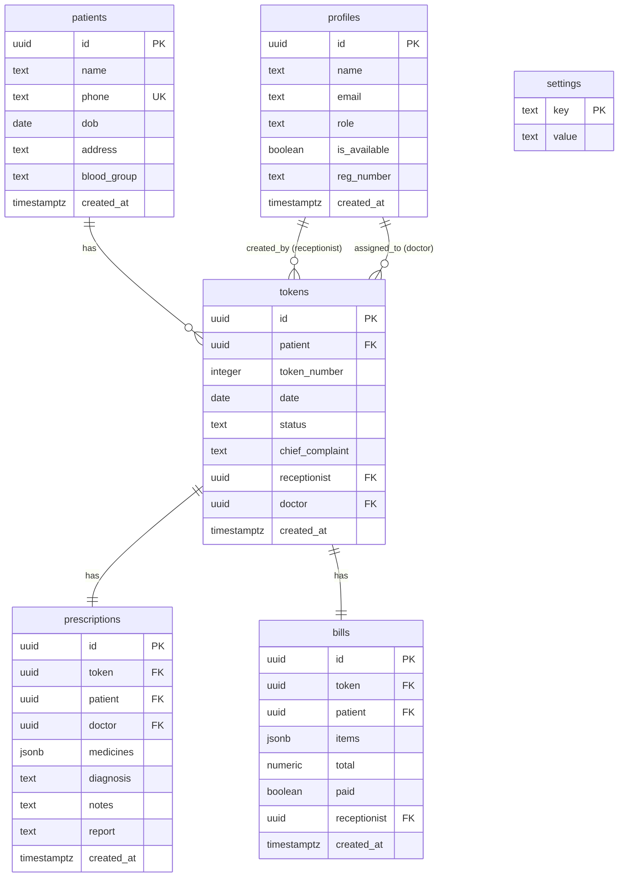

# CliniQ — Technical System Documentation

This document provides a detailed technical overview of the architecture, database schema, state propagation model, key components, and integration parameters of the CliniQ System.

---

## 🏛️ System Architecture & Routing Flow

CliniQ is structured as a client-side Single Page Application (SPA) backed by Supabase.

### 🔌 Router Configuration (`src/App.jsx`)
Routes are managed using React Router (`react-router-dom`). The pages are lazy-loaded via `React.lazy()` to optimize bundle size and speed:
* `/`: Portal Hub (`PortalHub` component) - A clean selection screen where users choose their portal (Receptionist vs. Doctor).
* `/receptionist`: The Receptionist Dashboard.
* `/doctor`: The Doctor Dashboard.
* `/admin`: Admin Placeholder.
* `/login` & `/register`: Standard authentication pages (unused under guest mode but preserved for future multi-tenant expansion).

### 👥 Guest Authentication Bypass
To remove the friction of login forms for internal clinic machines, the app implements a fallback guest system:
* **Doctor ID:** `d0000000-0000-0000-0000-000000000000` (seeded in the database).
* **Receptionist ID:** `e0000000-0000-0000-0000-000000000000` (seeded in the database).

In both dashboards, the authentication check resolves locally:
```javascript
const { user: authUser } = useAuth();
const user = authUser || {
  id: 'd0000000-...', // Guest ID matching role
  name: 'Guest Doctor / Receptionist',
  role: 'doctor / receptionist'
};
```
Security checks on routes (`src/components/ProtectedRoute.jsx`) are bypassed to support direct, unauthenticated browser access.

---

## 🗄️ Database Schema & Relationships

The database is built on PostgreSQL inside Supabase. The database schema consists of six key tables:



### Table Definitions

#### 1. `profiles`
Stores clinic staff accounts (Doctors, Receptionists, Administrators).
* `id`: UUID (references `auth.users(id)`). The constraint is dropped in guest setups to allow external guest inserts.
* `role`: Enum: `'doctor'`, `'receptionist'`, `'admin'`.
* `is_available`: Boolean (used to display availability on the receptionist dropdown).

#### 2. `patients`
Stores registered patient demographic records.
* `phone`: Unique text index to enforce unique phone number validation.

#### 3. `tokens`
Represents daily queue tickets.
* `date`: Defaults to PostgreSQL `current_date` (filtered client-side by local calendar dates).
* `status`: Enum: `'waiting'`, `'in_progress'`, `'done'`.
* `doctor`: UUID referencing `profiles(id)`. Represents the doctor currently assigned to consult the patient.

#### 4. `prescriptions`
EMR consultation documents authored by doctors.
* `medicines`: JSONB column storing structured arrays of medication metadata (`[{ name: 'Amoxicillin', dosage: '500mg', duration: '5 days' }]`).
* `report`: Clinical report text summarizing patient health findings printed directly onto the generated PDF.

#### 5. `bills`
Invoices generated by receptionists.
* `items`: JSONB array of charged items (`[{ description: 'Consultation Fee', amount: 500 }]`).
* `paid`: Boolean status indicating settlement.

---

## ⚡ Postgrest Ambiguous Join Resolution

### The Problem
The `tokens` table has **two** distinct foreign keys referencing the `profiles` table:
1. `receptionist` referencing `profiles(id)`
2. `doctor` referencing `profiles(id)`

If a query requests `.select('*, doctor:profiles(*)')`, Postgrest fails because the relationship between `tokens` and `profiles` is ambiguous (it doesn't know which foreign key maps to the request).

### The Solution
We append explicit relationship specifiers (`!column_name`) inside the select string:
```javascript
// Querying doctor and receptionist info on a token card:
supabase
  .from('tokens')
  .select('*, patient:patients(*), doctor:profiles!doctor(*), receptionist:profiles!receptionist(*)')
```
* `doctor:profiles!doctor(*)` joins `profiles` using the `doctor` column relationship.
* `receptionist:profiles!receptionist(*)` joins `profiles` using the `receptionist` column relationship.

---

## 🔄 Real-time Synchronization Model

CliniQ coordinates status transitions automatically using Supabase PostgreSQL replication. When data edits occur, views are instantly refreshed on both dashboards.

### Subscription Lifecycle (Doctor Dashboard Example)
Upon mounting, the dashboard connects to Supabase database event streams. When patients are added or tokens updated, callbacks fetch the updated data:

```javascript
useEffect(() => {
  fetchTokens();
  fetchCaseloadReport();

  // Listen to changes in tokens table
  const tokensChannel = supabase.channel('tokens-doctor')
    .on('postgres_changes', { event: '*', schema: 'public', table: 'tokens' }, () => {
      fetchTokens();
      fetchCaseloadReport();
    })
    .subscribe();

  return () => {
    supabase.removeChannel(tokensChannel);
  };
}, [fetchTokens, fetchCaseloadReport]);
```

---

## 🖥️ Core UI Component Integrations

### 1. Unified Token Queue (`src/components/TokenQueue.jsx`)
A shared component rendering patient queue items.
* **Props:**
  * `tokens`: Evaluated token records.
  * `showBillButton`: Shows billing button (receptionist dashboard).
  * `doctors`: List of doctors available for assignment dropdown.
  * `onAssignDoctor`: Callback when a new doctor is selected.
* **Logic:** Sorted dynamically using a computed order status mapping:
  ```javascript
  const statusOrder = { waiting: 0, in_progress: 1, done: 2 };
  const sorted = [...tokens].sort((a, b) => statusOrder[a.status] - statusOrder[b.status]);
  ```

### 2. Autocomplete Lookup Field (`src/pages/ReceptionistDashboard.jsx`)
Intelligent patient suggestions load immediately after typing 3 or more digits of a phone number:
```javascript
useEffect(() => {
  if (form.phone.length < 3) {
    setSuggestions([]);
    return;
  }
  const matching = allPatients
    .filter(p => p.phone.includes(form.phone))
    .slice(0, 5);
  setSuggestions(matching);
}, [form.phone, allPatients]);
```

---

## 📄 Prescription & Billing PDF Generators

Both portals support direct client-side generation and downloading of PDF slips using **jsPDF**.

### 🩺 Prescription PDF Generator (`src/lib/pdfPrescription.js`)
* Renders an **A5 Portrait** PDF layout suited for prescription printers.
* Calculates height adjustments dynamically to prevent text overlapping or running off the page boundaries.
* Renders diagnosis, medicines table, notes, and the clinical report summary block neatly aligned with lines and margins.

### 📋 Billing Invoice PDF Generator (`src/lib/pdfBill.js`)
* Generates a thermal receipt layout (standard dimensions) with tabular price lists, computed tax subtotals, invoice dates, and cashier credits.
