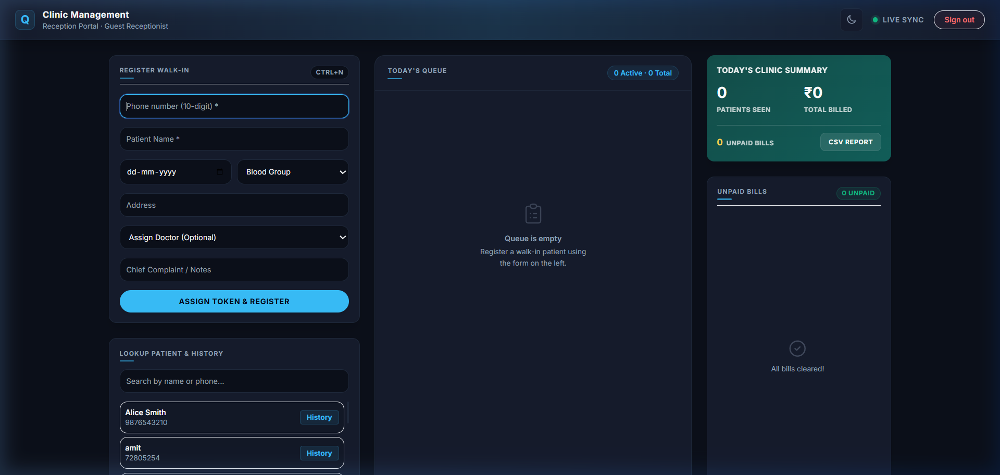
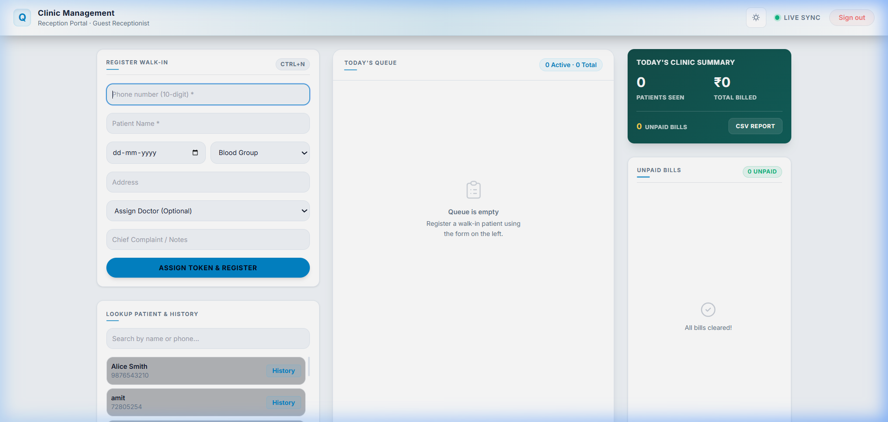
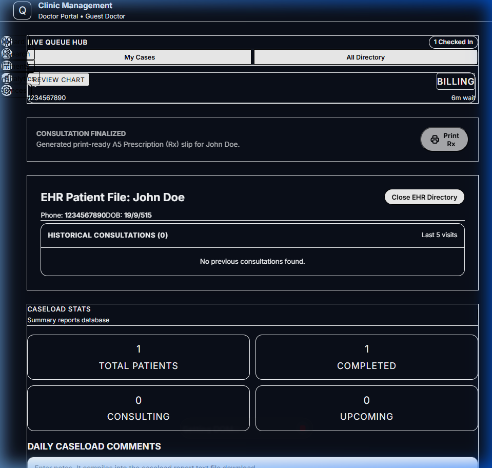
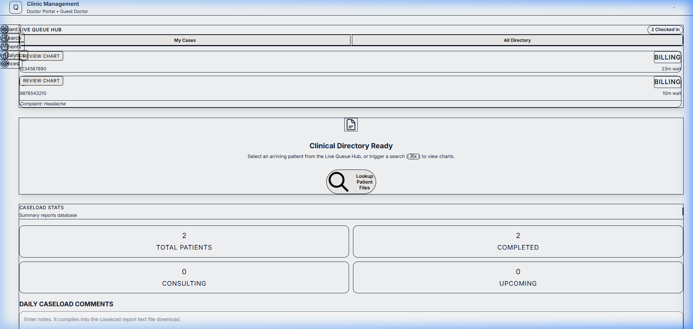

# CliniQ — Clinic Queue & EMR Management System

CliniQ is a premium, minimalist, and responsive clinic management web application built with **React**, **Vite**, **Tailwind CSS**, and **Supabase**. It provides a high-utility, modern interface featuring a stunning **Deep Obsidian** theme (with support for full Light/Dark theme toggle syncing).

The system seamlessly links two major clinical workflows: the **Receptionist Portal** (intake, queue, billing, duplicates check) and the **Doctor Portal** (consultation queue, digital prescription generator, drug interaction warnings, and A5 slip downloads).

---

## 📸 Live Web App Screenshots

### Receptionist Dashboard
| Dark Mode | Light Mode |
|:---:|:---:|
|  |  |

### Doctor Dashboard
| Dark Mode | Light Mode |
|:---:|:---:|
|  |  |

---

## 🚀 Getting Started

### 1. Clone the repository and install dependencies
```bash
npm install
```

### 2. Configure Environment Variables
Create a file named `.env.local` in the root of the project and add your Supabase credentials:
```env
VITE_SUPABASE_URL=https://your-supabase-project.supabase.co
VITE_SUPABASE_ANON_KEY=your-supabase-anon-publishable-key
VITE_APP_NAME="Clinic Management"
```

### 3. Run the Development Server
```bash
npm run dev
```
The application will run locally on [http://localhost:5173](http://localhost:5173).

---

## 🛠️ Database Setup (Supabase SQL)
Run the following SQL commands in the **SQL Editor** of your Supabase dashboard. This setup disables Row Level Security (RLS) for guest authentication, seeds default guest profiles, and enables real-time event streaming for instant client syncing:

```sql
-- 1. Disable Row Level Security (RLS) on all tables for guest access
alter table public.profiles disable row level security;
alter table public.patients disable row level security;
alter table public.tokens disable row level security;
alter table public.prescriptions disable row level security;
alter table public.bills disable row level security;
alter table public.settings disable row level security;

-- 2. Drop the foreign key constraint that requires profile IDs to exist in auth.users
alter table public.profiles drop constraint if exists profiles_id_fkey;

-- 3. Pre-populate default guest profiles
insert into public.profiles (id, name, email, role, is_available) values
  ('d0000000-0000-0000-0000-000000000000', 'Guest Doctor', 'doctor@cliniq.com', 'doctor', true),
  ('e0000000-0000-0000-0000-000000000000', 'Guest Receptionist', 'receptionist@cliniq.com', 'receptionist', true)
on conflict (id) do update set
  name = excluded.name,
  role = excluded.role,
  is_available = excluded.is_available;

-- 4. Enable real-time replication for tables
do $$
begin
  alter publication supabase_realtime drop table public.tokens, public.patients, public.bills, public.profiles;
exception
  when others then null;
end $$;

alter publication supabase_realtime add table public.tokens, public.patients, public.bills, public.profiles;
```

---

## 📁 Key Features & Clinical Safety Controls

### 📋 Receptionist Portal
* **Walk-in Registration:** Intake form capturing patient details, DOB, blood group, address, and complaint, with **autocomplete suggestions** for returning phone numbers.
* **Allergies Capture:** Intake form includes a dedicated allergies section that syncs to the patient database immediately.
* **Duplicate Profile Warnings (Name + DOB):** Intercepts registration if another profile matches the exact Name and DOB to prevent database clutter, presenting confirmation alerts.
* **Duplicate Invoice Prevention:** Detects if an invoice has already been generated for the patient's visit token. If so, requires acknowledgement via a warning checkbox before proceeding.
* **Smart Token Queue:** Generates unique queue numbers with left accent status lines (`waiting`, `in_progress`, `done`) and wait estimators.
* **Predefined Presets & Billing:** Instantly generates A5 thermal invoice PDFs using common presets or custom billing codes.

### 🩺 Doctor Portal
* **Consultation Queue:** Select from waiting queue list or filter to see all patients.
* **Interactive Allergy Alert Banner:** Displays patient allergies prominently above waveforms. Allows inline editing and saving directly to the patient's records on the fly.
* **Drug-Drug Interaction Warnings:** Evaluates currently prescribed items and historic medication lists for critical drug interactions (e.g. *Warfarin + Aspirin*, *Lisinopril + Spironolactone*, *Sildenafil + Nitroglycerin*), rendering dynamic warning boxes.
* **SOAP Encounters & Templates:** Rapidly write clinical notes using template hotkeys like bold, lists, and quick-add vitals (e.g. Temperature).
* **Caseload Reports:** Download caseload logs, status files, and `.txt` summary reports.
* **Prescription Slip Downloads:** Prints styled patient cards with detailed complaints, diagnoses, active medication guidelines, and clinical notes.

### 🛡️ App-wide Data Integrity Controls
* **Unsaved Changes Warning:** Prompts a browser exit alert (`beforeunload`) if the user tries to navigate away with unsaved SOAP details or walk-in registration details.
* **Automatic Draft Recovery:** Encounters and registration forms are continuously auto-saved to `localStorage` to survive accidental tab closures. Auto-recovered drafts are cleared upon successful submission.
* **Resilient Data Parsing:** Robust JSON check overrides prevent client-side parsing crashes on empty historical prescriptions.

---

## 📦 Deployment

### Vercel (Recommended)
This repository includes a `vercel.json` configuration ensuring client-side routes (like `/receptionist` and `/doctor`) resolve correctly upon browser refresh. Connect Vercel to your repository, declare `VITE_SUPABASE_URL` and `VITE_SUPABASE_ANON_KEY` as environment variables in Vercel settings, and click **Deploy**.

### Netlify
A Netlify `_redirects` file is included in the `public` directory. Simply link Netlify to your repository, declare the environment variables, and build.

---

*For detailed code structures, state models, database tables, and UI component walkthroughs, please consult the [DOCUMENTATION.md](./DOCUMENTATION.md) file.*
